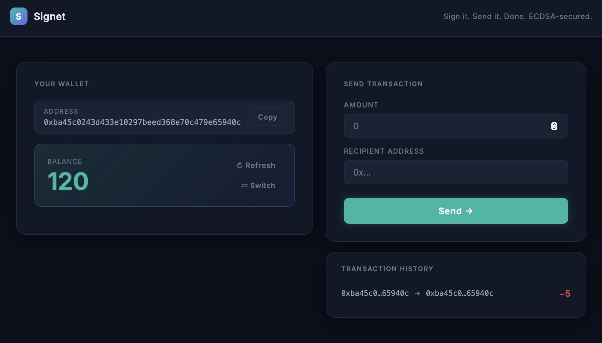

# Signet

**Signet** is a browser-based crypto payment app built on top of Elliptic Curve Digital Signatures (ECDSA). Every transfer is cryptographically signed in the browser — your private key never leaves your device.

> Built as part of **Week 1** of the [Intro to Ethereum Bootcamp](https://university.alchemy.com/) on **Alchemy University**.

> ⚠️ **Demo only.** This is a teaching project and is not intended for production use. Private keys are stored in browser memory, balances are in-memory only (not persisted), and there is no authentication layer. Use for learning and demonstration purposes only.

---

## Demo

**[Live Demo → signet-ecdsa.vercel.app](https://signet-ecdsa.vercel.app)**



---

## Key Features

- **Client-side signing** — transactions are signed with `secp256k1` directly in the browser; private keys are never sent to the server
- **Signature verification** — the server recovers the sender's public address from the signature alone and rejects any transfer that doesn't match
- **Select a test wallet** — choose from pre-seeded accounts with starting balances
- **Generate a new wallet** — create a fresh key pair in-browser with one click
- **Copy address** — one-click copy with visual confirmation
- **Recipient balance preview** — see the recipient's current balance before you send
- **Transaction history** — a running log of transfers made in the current session
- **Auto-funded addresses** — any new address is seeded with 100 tokens on first lookup (faucet)

---

## How It Works

1. The client signs the message `"<recipient>:<amount>"` using the sender's private key (`keccak256` hash, `secp256k1` signature)
2. The server receives the compact signature + recovery bit — **not the private key**
3. The server recovers the sender's public address from the signature and verifies it matches the claimed sender
4. If valid and the sender has sufficient funds, balances are updated

---

## Running Locally

You'll need **Node.js** (v18+) installed.

### 1. Clone the repo

```bash
git clone https://github.com/kayanhales/ecdsa-node.git
cd ecdsa-node
```

### 2. Start the server

```bash
cd server
npm install
node index
```

The server runs on `http://localhost:3042`.

> Tip: install `nodemon` (`npm i -g nodemon`) and use `nodemon index` to auto-restart on file changes.

### 3. Start the client

Open a new terminal tab:

```bash
cd client
npm install
npm run dev
```

Visit `http://localhost:5173` in your browser.

---

## Deployment

The live demo is hosted across two free services:

| Service | Role | URL |
|---|---|---|
| [Vercel](https://vercel.com) | Frontend (React/Vite) | [signet-ecdsa.vercel.app](https://signet-ecdsa.vercel.app) |
| [Render](https://render.com) | Backend (Node/Express) | — |

> Note: Render's free tier spins down after 15 minutes of inactivity. The first request after idle may take ~30 seconds to wake up.

---

## Tech Stack

| Layer | Tech |
|---|---|
| Frontend | React, Vite, SCSS |
| Signing | [`ethereum-cryptography`](https://github.com/ethereumjs/js-ethereum-cryptography) v2 (`secp256k1`, `keccak256`) |
| Backend | Node.js, Express |

---

## Project Origin

This project is the Week 1 capstone of the [Intro to Ethereum Bootcamp](https://university.alchemy.com/) on **Alchemy University**. The original scaffold challenged students to:

1. Replace simple account IDs with real ECDSA public key addresses
2. Sign transactions on the client and recover the sender's address on the server
3. Ensure private keys are never transmitted over the network

Signet is a fully implemented solution to all three phases, with an added UI layer.
